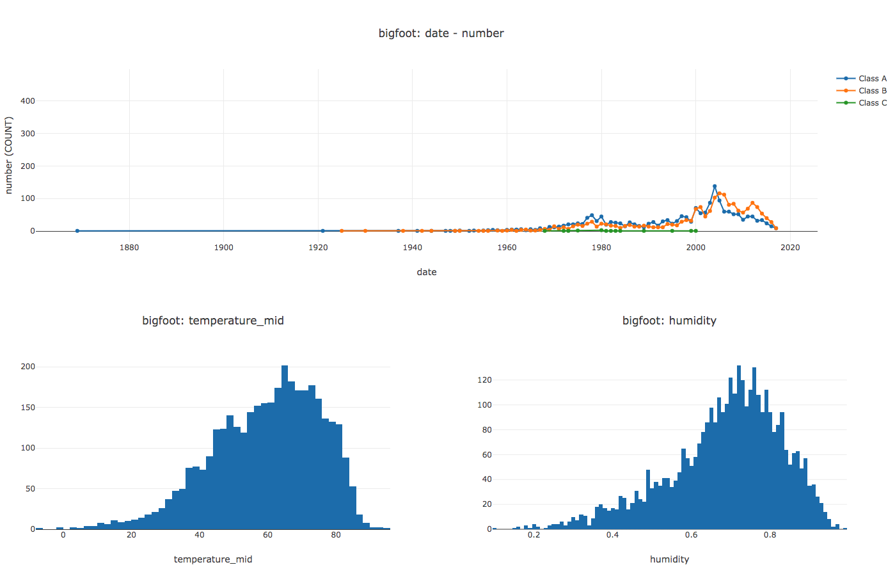

# SVL: Declarative Data Visualizations

[](https://travis-ci.org/timothyrenner/svl) [](https://coveralls.io/github/timothyrenner/svl?branch=master) [](https://github.com/python/black)

SVL is a declarative, SQL-like language for simple data visualizations.

Initially I made this project to learn and experiment with [EBNF](https://en.wikipedia.org/wiki/Extended_Backus%E2%80%93Naur_form) context-free grammars, but pretty quickly realized this was something I could actually use for my job.
Maybe you will find it useful too.

If you're interested, hit the link for the docs below.

[timothyrenner.github.io/svl](https://timothyrenner.github.io/svl/)

and install with

```
pip install svl
```

Not convinced?
Maybe ✨ ***this*** ✨ will change your mind...

SVL code:

```
DATASETS
    bigfoot "sample_data/bigfoot_sightings.csv"
LINE bigfoot
    X date BY YEAR
    Y number COUNT
    SPLIT BY classification
CONCAT(
    HISTOGRAM bigfoot X temperature_mid
    HISTOGRAM bigfoot X humidity
)
```

Results:



## Alpha Features

✅ **Easy to learn**: The entire grammar is under 150 lines.

🖐 **Five chart types**: Line, bar, scatter, histogram and pie. I plan on adding more, so if I'm missing your favorite one let me know.

📈 **Complex layouts**: SVL scripts can support any number of plots and makes it straightforward to arrange them so that the most important plots get the most real estate.

📊 **Interactive HTML output**: SVL uses [Plotly](https://plot.ly/javascript/) to draw the visualizations, and produces an easily shareable but still interactive HTML file.

📂 **CSV and Parquet files**: Currently the data is limited to files, and SVL has support for CSV and (if [pyarrow](https://arrow.apache.org/docs/python/) is installed) parquet files.

## Not Alpha Features, but Possible

**Other plot backends** The compiler isn't married to Plotly.
SVL can have future support for other backends like Vega, Bokeh, or even Matplotlib (probably).

**Other data sources** For simplicity SVL operates on files, but like the plot renderer the compiler isn't coupled to flat files.
In fact, most of the data processing is done under the hood by [SQLite](https://sqlite.org/index.html), so adding support for other data processors like Postgres or MySQL is definitely possible.

**Other plot types** I picked those five for the alpha release because they're the most common, but obviously more support can be added. Let me know what other chart types you'd like to see!

## I'm sold!

🎉 Sweet! 🎉 Check out the docs [here](https://timothyrenner.github.io/svl/) to learn more.


## Development

I've been using [Anaconda](https://www.anaconda.com/distribution/) to manage environments.
If you've got that installed, just do

```bash
conda env create -f env.yml

# then install the module

conda activate svl && pip install -e .
```

To run the tests,

```bash
pytest test/ --cov=svl  # last option if you want coverage.
```

To lint,

```bash
flake8 svl
```

in the top level directory and start hacking away!