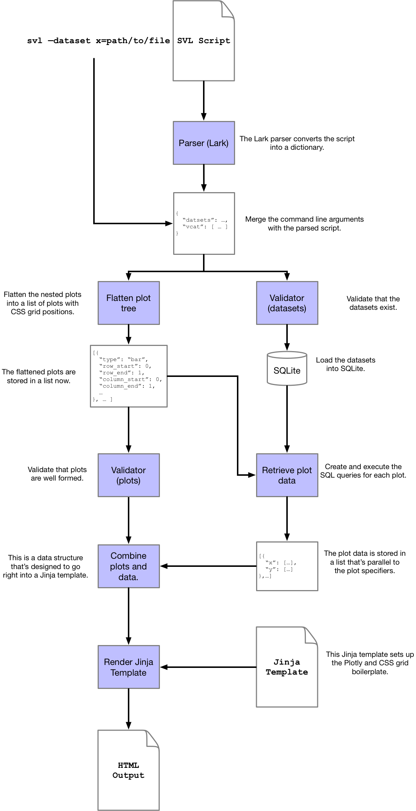

# Under the Hood

This document describes the structure of the compiler.
I'll start by describing the compiler's stages in sequence, then present a diagram at the end with everything.

The entire compiler is written in Python, with a sprinkling of HTML / JS to render the final HTML page.

## Parsing

The language itself is defined as an EBNF grammar designed to be parsed by the freaking awesome [Lark](https://github.com/lark-parser/lark) parser.
The grammar itself is defined in [this file](https://github.com/timothyrenner/svl/blob/master/resources/svl.lark).
This probably isn't the cleanest representation (I've never done this before / don't have formal CS training), but it gets the job done.

Lark takes the grammar specification and the input script and parses that into a bunch of custom objects.
I've implemented an adapter to convert those objects into a python dictionary that provides a tree-like representation of the plots.

The reason this is a tree has to do with `CONCAT( ... )` and `( ... )`.
A chart is defined as either a raw plot, or a concatenation of plots.
This means they can nest within one another, which makes them a tree.

Concretely, given this script:

```
DATASETS
        bigfoot "bigfoot_sightings.csv"
CONCAT(
    SCATTER bigfoot
        X latitude
        Y temperature_mid
    BAR bigfoot
        X classification
        Y classification COUNT
)
```

the resulting tree looks like:

```python
{
    "datasets": {
        "bigfoot": {
            "file": "bigfoot_sightings.csv"
        }
    },
    "vcat": [{
        "hcat": [
            {
                "data": "bigfoot",
                "type": "scatter",
                "x": {"field": "latitude"},
                "y": {"field": "temperature_mid"}
            }, {
                "data": "bigfoot",
                "type": "bar",
                "x": {"field": "classification"},
                "y": {"agg": "COUNT", "field": "classification"}
            }
        ]
    }]
}
```

The outermost `vcat` (vertical concatenation) is always there, and _inside_ that there's an `hcat` (horizontal concatenation).
Either of the plots inside the `hcat` could itself be an `hcat` or `vcat` ... and on and on.

## Flattening the Plot Tree

Trees are nice inside a programming environment, but I need these plots to get rendered onto a web page, which means I need to project the tree onto a grid.
I implemented plot layouts with [CSS grids]() because they're pretty straightforward once you get your head around it.
Basically, CSS grids need a layout declaration, and each element in the grid needs a position.

So I need to go from tree of plots to a list of plots that have grid positions.
I can traverse the tree and track the position as I go, but there's a minor hiccup: CSS grids are _uniform_, but our plots aren't.

If I've got one plot on one row, then there's only one CSS column / row.
If I've got one plot on the first row and two on the second (via `CONCAT`), then I need CSS to have two columns and two rows.
If I've got one plot on the first row and three plots on the second row, but the two on the right are stacked, then I need 4 columns and 4 rows... _and_ I need to ensure that the top plot takes up 2 rows and 4 columns, and so forth.

Concretely, given this tree (I've replaced the plot details with simple dicts for readability)...

```python
{
    "vcat": [
        {
            "hcat": [
                {"plot": 1},
                {"plot": 2}
            ]
        }, {
            "vcat": [
                {"plot": 3},
                {"plot": 4}
            ]
        }
    ]
}
```

This tree puts two side-by-side plots on the first row, and two vertical plots on the second row.
As real output this would look weird, but it's a good example.
The first row of plots take up one column and two rows each, while the second row of plots take up one row and two columns each.

SVL flattens the above to this list.

```python
[
    {
        "plot": 1,
        "row_start": 0,
        "row_end": 2,
        "column_start": 0,
        "column_end": 1
    }, {
        "plot": 2,
        "row_start": 0,
        "row_end": 2,
        "column_start": 1,
        "column_end": 2
    }, {
        "plot": 3,
        "row_start": 2,
        "row_end": 3,
        "column_start": 0,
        "column_end": 2
    }, {
        "plot": 4,
        "row_start": 3,
        "row_end": 4,
        "column_start": 0,
        "column_end": 2
    }
]
```

This piece of the compiler is complicated.
It took me over 2 months to get this right.
The [unit tests](https://github.com/timothyrenner/svl/blob/master/test/test_layout.py) for this algorithm total up to almost 700 lines of code.
It's the only time I've ever used TDD (it worked very well for this).

## Loading the SQLite DB

This piece is pretty straightforward.
Because I'm ~~lazy~~ efficient, I decided to use [pandas]() to read the files and load the SQLite database.
Files are loaded first, then the SQL datasets are constructed in the order they appear in the script.

## Retrieving the Plot Data

This functionality is the proud home of probably the [worst](https://github.com/timothyrenner/svl/blob/master/svl/sqlite.py#L351) code of the whole compiler (I'm going to refactor it soon because it makes my eyes bleed), but the functionality _in principle_ is simple.
It translates the SVL plot specifier (after flattening) into a SQL query, then marshals those results into something that can be injected into a Plotly data structure.

For example, consider the following plot.

```python
{
    "data": "bigfoot",
    "type": "bar",
    "x": {
        "agg": "AVG",
        "field": "temperature"
    },
    "y": {
        "field": "classification"
    }
}
```

This is the internal representation of a bar chart that averages temperature by classification.
SVL turns this into the following SQL query

```sql
SELECT AVG(temperature) AS x, classification AS y
FROM bigfoot GROUP BY classification
```

This is where `FILTER` and `TRANSFORM` SQL gets applied as well.
This is the internal representation of a scatter plot that puts latitude on X and temperature on Y, but filters latitudes.

```python
{
    "data": "bigfoot",
    "x": {
        "field": "latitude"
    },
    "y": {
        "field": "temperature"
    },
    "filter": "latitude < 84"
}
```

This is the query.

```sql
SELECT latitude AS x, temperature AS y
FROM bigfoot
WHERE latitude < 84
```

Once the query is executed, the data is marshalled into a data structure that looks like this:

```python
{
    "x": [ ... ],
    "y": [ ... ]
}
```

There are variations of that based on whether there are `SPLIT BY` or `COLOR BY` arguments, but basically that's all there is to it.
There's tons of edge cases and other weird stuff that happens here that makes the code a little tedious, but I think I can probably find a nice way to do it in the future.

## Combining Plots and Data

So we have a flat list of plot specifiers, and a flat list of data representations.
Both of these are completely internal representations; they're agnostic to the plotting machinery.
This is the point where they combine to form Plotly graphs (as dictionaries, not Plotly's graph objs).
There's a function for each plot type that combines the data and specifier into a plotly graph.
It's a little tedious so I'm not going to go into the details of the Plotly graph specifiers - you can read about it [here](https://plot.ly/javascript/).
The important part is, for each plot, we extract this information:

```python
{
    "row_start": row_start,
    "row_end": row_end,
    "column_start": column_start,
    "column_end": column_end,
    "plotly": { ... }  # This is a the plotly specifier.
}
```

Basically we have the plot's CSS grid position and the plot data structure itself.
These plots, along with the number of columns and rows, are passed to the Jinja template.

## Jinja

With the CSS grid position of each plot in place, the whole page is just a flat sequence of Plotly `div` elements that have the grid positions as CSS style elements.
The identifiers for each `div` element is derived from the grid position.

This is the whole thing.

```jinja
<!DOCTYPE html>
<html>
    <head>
        <meta charset="UTF-8"/>
        <title>SVL Plots</title>
        <script src="https://cdn.plot.ly/plotly-latest.min.js"></script>
        <style>
            .container {
                display: grid;
                grid-template-columns: repeat({{ num_columns }}, minmax(300px, {{ 100 / num_columns }}vw));
                grid-template-rows: repeat({{ num_rows }}, minmax(300px, {{ 100 / num_rows }}vh));
            }

            
            #p{{ plot.row_start }}_{{ plot.column_start }} {
                grid-column-start: {{ plot.column_start }};
                grid-column-end: {{ plot.column_end }};
                grid-row-start: {{ plot.row_start }};
                grid-row-end: {{ plot.row_end }};
            }
            
        </style>
    </head>
    <body>
        <div class="container">
            
            <div id="p{{ plot.row_start }}_{{ plot.column_start }}">
            </div>
            
        </div>
        <script>
            
            var plot_{{ plot.row_start }}_{{ plot.column_start }} = 
                Plotly.newPlot(
                    "p{{ plot.row_start }}_{{ plot.column_start }}",
                    {{ plot.plotly | tojson }}
                );
            
        </script>
    </body>
</html>
```

And that's it.
Hopefully it's clear that elements are loosely coupled - in particular the data processor doesn't _have_ to be SQLite and the final plot output doesn't _have_ to be drawn by Plotly.
If there's enough demand I could certainly see future work in expanding the plot renderers as well as additional data processors.

## The Whole Enchilada

