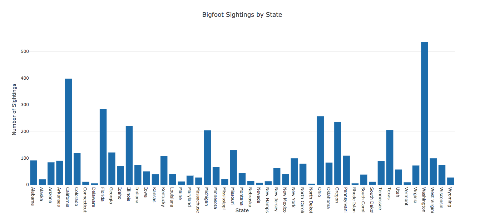
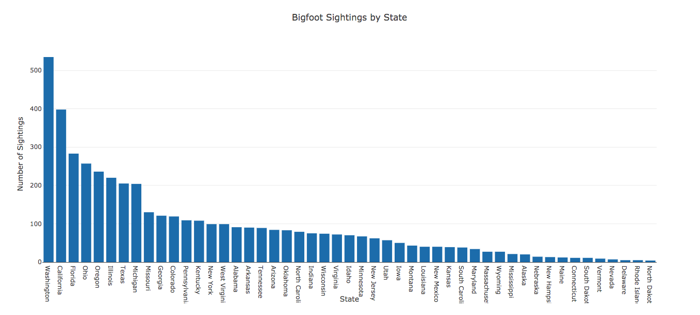
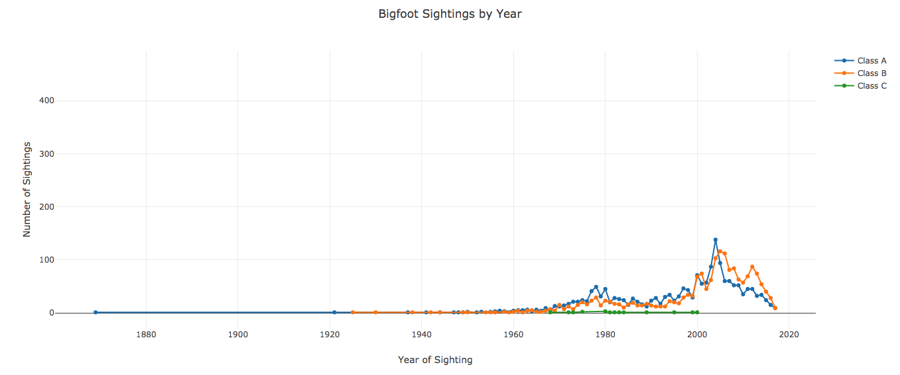
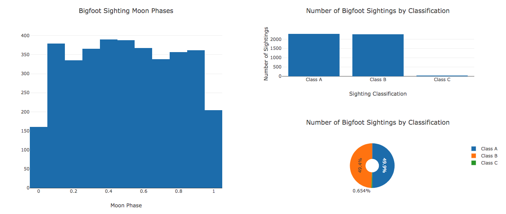
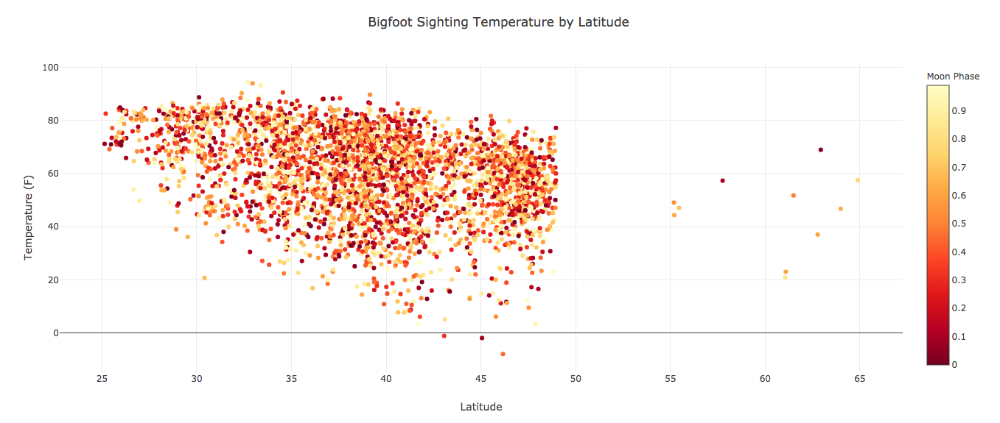
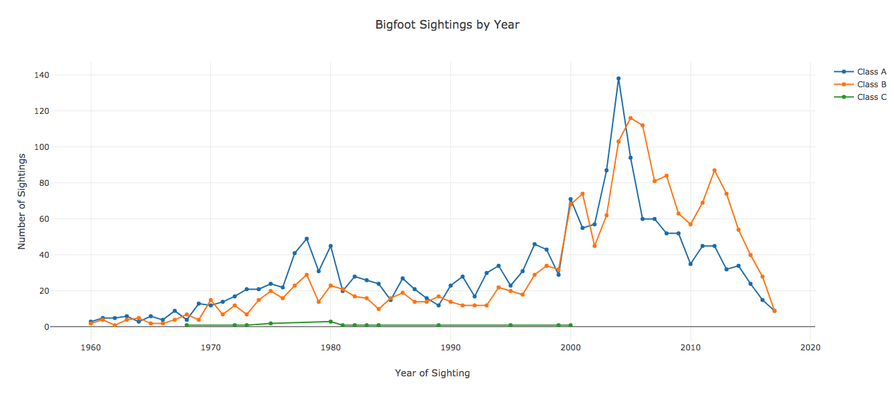
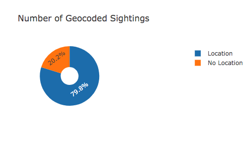

# Advanced SVL

The [basic SVL](basic_svl.md) tutorial covered how to make, customize and arrange plots.
SVL also has advanced SQL-powered data processing capabilities that make it easy to adjust your datasets without writing a bunch of additional code.

Before getting in to the SQL parts, there are a couple of things to cover first.
This tutorial uses the same dataset as the basic tutorial.
I'll go ahead and use the `basic_tutorial.svl` script from the basic SVL tutorial as a starting point.

```
cp basic_tutorial.svl advanced_tutorial.svl
```

## Sorting Data

Suppose I want to see which states have the most bigfoot sightings.
That's pretty easy.
Add this underneath the line chart.

```
BAR bigfoot
    TITLE "Bigfoot Sightings by State"
    X state LABEL "State"
    Y state COUNT LABEL "Number of Sightings"
```

It looks like this:



Notice that it's unsorted.
SVL supports sorting an axis as a modifier.

```
BAR bigfoot
    TITLE "Bigfoot Sightings by State"
    X state LABEL "State"
    Y state COUNT LABEL "Number of Sightings" SORT DESC
```

Now our bar chart looks like this:



`SORT` must be followed by `ASC` or `DESC`.

Here's the full script.

```
DATASETS
    bigfoot "bigfoot_sightings.csv"

LINE bigfoot
    TITLE "Bigfoot Sightings by Year"
    X date BY YEAR LABEL "Year of Sighting"
    Y number COUNT LABEL "Number of Sightings"
    SPLIT BY classification

BAR bigfoot
    TITLE "Bigfoot Sightings by State"
    X state LABEL "State"
    Y state COUNT LABEL "Number of Sightings" SORT DESC

CONCAT(
    HISTOGRAM bigfoot
        TITLE "Bigfoot Sighting Moon Phases"
        X moon_phase LABEL "Moon Phase"
        STEP 0.1

    (
        BAR bigfoot
            TITLE "Number of Bigfoot Sightings by Classification"
            X classification LABEL "Sighting Classification"
            Y number COUNT LABEL "Number of Sightings"

        PIE bigfoot
            TITLE "Number of Bigfoot Sightings by Classification"
            AXIS classification
            HOLE 0.3
    )
)

SCATTER bigfoot
    TITLE "Bigfoot Sighting Temperature by Latitude"
    X latitude LABEL "Latitude"
    Y temperature_mid LABEL "Temperature (F)"
    COLOR BY moon_phase "YlOrRd" LABEL "Moon Phase"
```






Interactive version [here](../sample_visualizations/advanced_tutorial_sort.html)

## Datasets at the Command Line

Sometimes it might be convenient not to have the name of the file hard coded into the SVL script.
For example, suppose you've got a pipeline that produces files with dates in the name.
It would be nice if you could create the same visualizations and treat the file as a parameter.
SVL supports passing in dataset file definitions from the command line.
In fact, the `DATASETS` declaration is optional.

```
-- No DATASETS!

LINE bigfoot
    TITLE "Bigfoot Sightings by Year"
    X date BY YEAR LABEL "Year of Sighting"
    Y number COUNT LABEL "Number of Sightings"
    SPLIT BY classification

BAR bigfoot
    TITLE "Bigfoot Sightings by State"
    X state LABEL "State"
    Y state COUNT LABEL "Number of Sightings" SORT DESC

CONCAT(
    HISTOGRAM bigfoot
        TITLE "Bigfoot Sighting Moon Phases"
        X moon_phase LABEL "Moon Phase"
        STEP 0.1

    (
        BAR bigfoot
            TITLE "Number of Bigfoot Sightings by Classification"
            X classification LABEL "Sighting Classification"
            Y number COUNT LABEL "Number of Sightings"

        PIE bigfoot
            TITLE "Number of Bigfoot Sightings by Classification"
            AXIS classification
            HOLE 0.3
    )
)

SCATTER bigfoot
    TITLE "Bigfoot Sighting Temperature by Latitude"
    X latitude LABEL "Latitude"
    Y temperature_mid LABEL "Temperature (F)"
    COLOR BY moon_phase "YlOrRd" LABEL "Moon Phase"
```

is what our Bigfoot SVL script looks like without a `DATASETS` declaration.
It won't compile without one additional command line argument.

```
svl advanced_tutorial.svl --dataset bigfoot=bigfoot_sightings.csv
```

You can pass multiple files with different labels by repeating `--dataset label=path` for each file.

For simplicity I haven't changed this in the `advanced_tutorial.svl` script, I just wanted to demonstrate what it would look like.

## Data in SVL

Before proceeding with the next few topics it's worth describing a _tiny bit_ what's under the hood when it processes data.
I'll leave the gory parts to [this section](../reference/under_the_hood.md), but a quick description of how SVL processes and retrieves data for plots will make the next few topics easier.

SVL's data processing is powered by SQLite.
After the source code is parsed and checked for syntax errors, SVL assembles the datasets in the `DATASETS` declaration plus any that were passed in via command line and loads them into an in-memory SQLite database.
For each plot, SVL constructs a SQL query to produce the data needed for the plot, executes it, and arranges it in a data structure that Plotly can understand.

Doing data processing using SQLite has a couple of big advantages.

1. If most of the data work is in SQL, then there's nothing specific about the data being "in-memory" or SQLite itself. In the future this keeps open the possibility of supporting other databases.
2. SVL can inject SQL directly into the data processing queries for the plots. This means SVL can support filters and transformations on the data without the need for tons of additional syntax - you can use what you already know.

The next three sections cover using `FILTER` to filter the data, using `TRANSFORM` to transform the data for an axis, and creating custom datasets within SVL by transforming the datasets that live in files.
All three of these use the underlying SQLite processor to do the heavy lifting.

### Filtering Data

In the last tutorial I mentioned our line chart had some outliers that were causing the plot to look funny.
Let's fix that by applying a filter to the data for that plot.

```
LINE bigfoot
    TITLE "Bigfoot Sightings by Year"
    X date BY YEAR LABEL "Year of Sighting"
    Y number COUNT LABEL "Number of Sightings"
    SPLIT BY classification
    -- The filter string gets pasted into a SQL WHERE clause.
    FILTER "date > '1960-01-01'"
```

Now the plot looks much better.



🎉 Much better! 🎉

The most important thing to note is that SVL has _no idea_ what's in those quotes.
It literally pastes the stuff in quotes right into the query.
The field names of the dataset match the field names in the SQLite database.
Other than that - there are no rules, so use with caution.
I might have to rethink this when introducing remote data sources for security reasons, but for now it's only dangerous to you 😄.

### Transforming Data

I have a confession to make - I like pie charts.
The caveat is that I pretty much only like them for one thing: counting null values.
I want to rewrite our pie chart to count the number of null locations in the Bigfoot dataset.

Thankfully SVL doesn't support SQL just for filters.
It can also apply arbitrary SQL to transform an axis as well.
Replace the existing pie chart in the `advanced_tutorial.svl` script with this.

```
PIE bigfoot
    TITLE "Number of Geocoded Sightings"
    -- Yes line breaks do work.
    AXIS TRANSFORM 
        "CASE WHEN latitude IS NULL THEN 'No Location' 
         ELSE 'Location' END"
    HOLE 0.3
```



Just like with `FILTER`, everything in quotes after `TRANSFORM` literally gets pasted into a SQL query (this time it's a SELECT instead of WHERE).
SVL has _no idea_ what's in those quotes, so keeping it simple is probably a good idea.

### Custom Datasets

### All Together

## Conclusion
