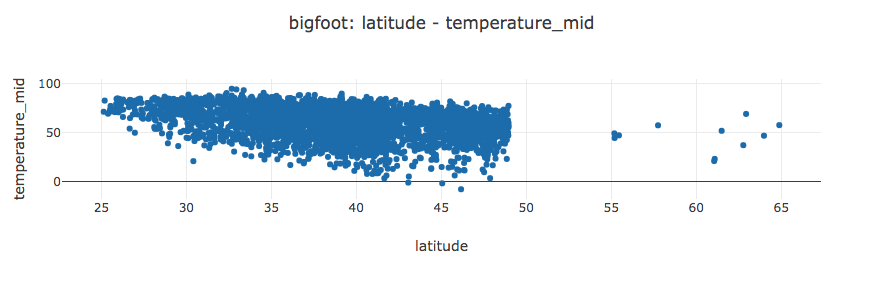

# Basic SVL

This tutorial will walk through the basics of creating SVL programs.
By the end of this tutorial you will know how to

* declare datasets
* create all five chart types
* customize charts with titles and axis labels
* split dataset by a categorical variable
* color a dataset by a continuous variable
* normalize temporal fields
* arrange multiple plots in a single output file

And you will learn all of these things working on a real world not-really-cleaned dataset of [Bigfoot sightings](https://data.world/timothyrenner/bfro-sightings-data).
This dataset was collected by the Bigfoot Field Researchers Organization ([BFRO](http://bfro.net/)).

Start by downloading that dataset into the current directory.

```
wget https://github.com/timothyrenner/svl/raw/docs/sample_data/bigfoot_sightings.csv
```

The tutorial's been designed to operate on a single file, but it can be split up too.
I'll include a complete version of the state of the file (which I'll name `bigfoot_basic.svl`) at the end of each section.

## Boring Stuff

Before I start there's boring stuff I need to cover.

1. All keywords in SVL are case-**insensitive**, but field names, file names, and anything in quotes are not. By convention I will capitalize keywords but it's not required.
2. Comments start with `--` and extend to the end of the line.
3. All dataset and field names (basically anything not in quotes) must start with an underscore or letter, and can only contain letters, underscores or digits.
4. SVL is not sensitive to tabs or newlines. The entire program could be written on one line if you wanted.

Aside from field and dataset names being case sensitive, this is pretty much just like SQL.

## Datasets

An SVL program usually starts with a datset declaration.
This tells the compiler where your datsets live and assigns them a label.
This isn't required - datsets can be declared as compiler command line arguments, but that will be covered in the advanced SVL tutorial.

If an SVL program has a DATASETS declaration, it must be at the beginning of the program.
It looks like this.

```
DATASETS
    bigfoot "bigfoot_sightings.csv"
```

The name of the dataset is an identifier, and the name of the file must be in quotes.

Naturally this SVL program won't compile - we need some plots first.
The next section will walk you through the plot types.

## Chart Types

SVL supports five plot types: histogram, scatter, bar, line, and ... my personal favorite ... pie charts.
Don't worry, you can add holes to your pie charts so your friends won't judge.

### HISTOGRAM

Histograms are for binning a single variable.
Let's say we want to (and we _definitely_ do) figure out if more bigfoot sightings occur during a particular phase of the moon.
Add this to your `basic_tutorial.svl` file under the DATASETS declaration.

```
HISTOGRAM bigfoot    -- same name as DATASETS
    X moon_phase     -- can specify Y for vertical histogram
    STEP 0.1         -- optional, can also specify BINS to set number of bins
```

Compile it with

```
svl basic_tutorial.svl
```

and you should see


A couple of things to note:

1. Axes are declared by `X` or `Y` followed by the field. This is true of all plot types except pie charts.
2. Only histograms take a `STEP` or `BINS`, but they aren't required.

### SCATTER

Scatter plots need two axes.
Suppose we want to see if the southern Sasquatch (colloquially referred to as "skunk ape") prefers warmer temperatures farther south, or if they prefer the same temperature as their Pacific Northwest cousins).

Add this to `basic_tutorial.svl` underneath the histogram.

```
SCATTER bigfoot
    X latitude
    Y temperature_mid
```

That's it.
Compile again and it'll appear right under the histogram.



### BAR

Bar charts are basically declared the same way as scatter plots, except that they usually appear with aggregations.
Bigfoot sighting reports are classified by three types: A, B and C.
A is direct evidence, B is indirect evidence, and C is a secondhand account.
Suppose we want to count the number of sightings with each classification rating.

```
BAR bigfoot
    X classification
    Y number COUNT    -- COUNT is an aggregation, number is a field in the dataset.
```

This plot will count the number of reports for each classification.


A couple of things to note:

1. There are four aggregations: `COUNT`, `MIN`, `MAX`, `AVG`. More will probably be added in the future.
2. It's probably not a good idea to bar chart continuous variables, but SVL won't stop you.
3. `COUNT` _shouldn't_ need the field label but for technical reasons it does. I'll probably fix this at some point in the near future.

### LINE

Line charts, like bar charts, usually appear with aggregations.
They are good for plotting things like time.
If we want to know the number of bigfoot sightings over time, this plot will get us there.

```
LINE bigfoot
    X date BY YEAR
    Y number COUNT
```

This plot counts the number of sightings by year.


This plot also introduces a **temporal transformation**.
Basically, SVL truncates each date at the year and then counts each year's worth of sightings.
Currently only `YYYY-mm-ddTH:M:S` format is supported but it should be straightforward to support custom formats in the future.
The following temporal transformations are available: `YEAR`, `MONTH`, `DAY`, `HOUR`, `MINUTE`, `SECOND`.

### PIE

Pie charts are a little different from the others.
Basically they count the different values of the axis we select.
Suppose we wanted to view the proportion of sighting classifications.

```
PIE bigfoot
    AXIS classification
    HOLE 0.3               -- HOLE is only available for pie charts.
```

We get this


Note:

1. Pie charts require `AXIS` _instead_ of `X` or `Y`.
2. `HOLE` only applies to pie charts, and must be values between zero and one.

### In Summary

Let's tally up our Bigfoot knowledge.

```
DATASETS
    bigfoot "bigfoot_sightings.csv"

-- Keep in mind the line breaks and tabs are only to make things visually
-- coherent. They're not required by language syntax.

HISTOGRAM bigfoot    -- same name as DATASETS
    X moon_phase     -- can specify Y for vertical histogram
    STEP 0.1         -- optional, can also specify BINS to set number of bins

SCATTER bigfoot
    X latitude
    Y temperature_mid

BAR bigfoot
    X classification
    Y number COUNT    -- COUNT is an aggregation, number is a field in the dataset.

LINE bigfoot
    X date BY YEAR
    Y number COUNT

PIE bigfoot
    AXIS classification
    HOLE 0.3               -- HOLE is only available for pie charts.
```

And this is what it looks like:


You can view an interactive version [here](../sample_visualizations/basic_tutorial_chart_types.html).

A few things that jump out:

1. The titles and axis labels aren't pretty. I'll cover how to do that next.
2. The plots look stretched and weird. This is partly due to browser window width, and partly due to the fact that some of those plots (looking at you pie chart) don't need _that_ much screen real estate. The "Plot Arrangement" section covers this.
3. What if you want multiple lines / bars /etc on one plot - like number of sightings per classification? `SPLIT BY` and it's cousin `COLOR BY` cover how these additional axes work.

## Customizing Charts - Titles and Axis Labels

SVL provides default titles and labels for axes based on the fields in the file, but those aren't the prettiest.
To add some class to your plots, SVL provides the `TITLE` and `LABEL` keywords.
Here's a beautified version of our histogram.

```
HISTOGRAM bigfoot
    TITLE "Bigfoot Sighting Moon Phases"
    X moon_phase LABEL "Moon Phase"
    STEP 0.1
```

It looks like this:


`TITLE` can appear anywhere after the plot declaration (i.e. `HISTOGRAM bigfoot`).
`LABEL` can appear anywhere after the axis declaration (i.e. `X moon_phase`).

✅ **VALID AXIS LABEL**: `X moon_phase LABEL "Moon Phase"`

❌ **INVALID AXIS LABEL**: `X LABEL "Moon Phase" moon_phase``

For completeness here's a fully beautified example of our earlier results.

```
DATASETS
    -- Path is a little different from tutorial.
    bigfoot "sample_data/bigfoot_sightings.csv"

HISTOGRAM bigfoot
    TITLE "Bigfoot Sighting Moon Phases"
    X moon_phase LABEL "Moon Phase"
    STEP 0.1

SCATTER bigfoot
    TITLE "Bigfoot Sighting Temperature by Latitude"
    X latitude LABEL "Latitude"
    Y temperature_mid LABEL "Temperature (F)"

BAR bigfoot
    TITLE "Number of Bigfoot Sightings by Classification"
    X classification LABEL "Sighting Classification"
    Y number COUNT LABEL "Number of Sightings"

LINE bigfoot
    X date BY YEAR LABEL "Year of Sighting"
    TITLE "Bigfoot Sightings by Year"    -- TITLE can go between axes nbd.
    Y number COUNT LABEL "Number of Sightings"

PIE bigfoot
    TITLE "Number of Bigfoot Sightings by Classification"
    AXIS classification LABEL "This gets ignored"
    HOLE 0.3
```


You can see an interactive version of this visualization [here](../sample_visualizations/basic_tutorial_customizing_charts.html).

## Plot Arrangement

## Additional Axes: Split By and Color By